# Adapting Video Diffusion Models to World Models
### Marc Rigter, Tarun Gupta, Agrin Hilmkil and Chao Ma

  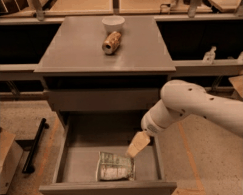
  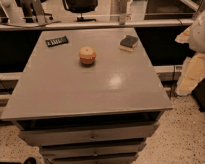
  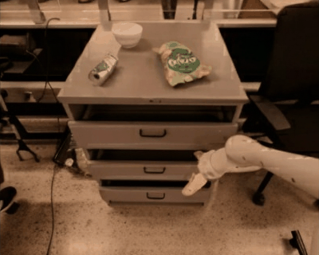
  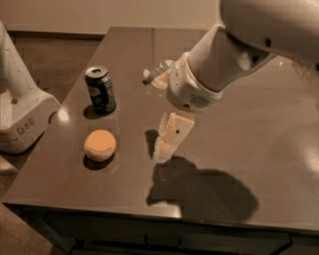
  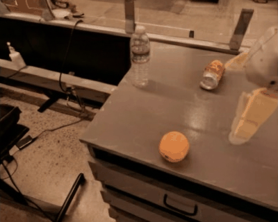

  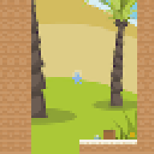
  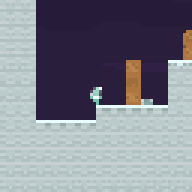
  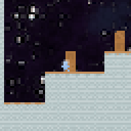
  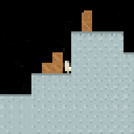
  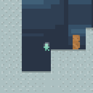
  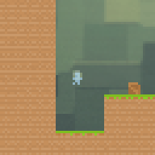
  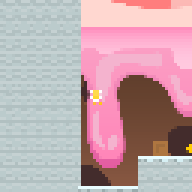

Official code to reproduce the experiments for ["Adapting Video Diffusion Models to World Models"](https://sites.google.com/view/avid-world-model-adapters/home) (AVID), which proposes to adapt pretrained video diffusion models to action-conditioned world models. 

AVID is implemented using both pixel-space diffusion and latent space diffusion. For instructions on how to use each of the codebases, please see [pixel_diffusion/README.md](pixel_diffusion/README.md) and [latent_diffusion/README.md](latent_diffusion/README.md). Results are logged to Weights and Biases.

### Acknowledgements

This project utilises code from [video-diffusion-pytorch](https://github.com/lucidrains/video-diffusion-pytorch), [DynamiCrafter](https://github.com/Doubiiu/DynamiCrafter), and [octo](https://github.com/octo-models/octo).
